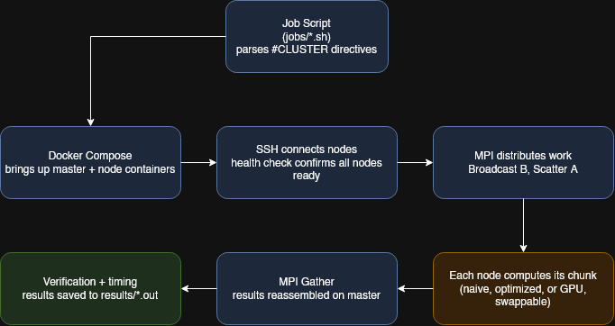

# mpi-matrix-bench

A simulated HPC cluster built with Docker, MPI, and CUDA, comparing naive and optimized CPU implementations against a GPU implementation of distributed matrix multiplication.

## Key Results

| Profile | Avg Per-Process Time | Total Job Time |
|---|---|---|
| CPU Naive (-O2) | ~1.19s | 1.50s |
| CPU Optimized (-O2) | ~0.10s | 0.29s |
| GPU CUDA (naive kernel) | ~0.54s | 0.66s |

Reordering the CPU multiplication loops for cache-friendly memory access produced a roughly 12x improvement over the naive implementation, at the same compiler optimization level. A naive, unoptimized CUDA kernel still outperforms naive CPU by roughly 2x, but does not outperform the optimized CPU version, showing that raw parallelism alone does not automatically beat careful, cache-aware algorithm design.

Full methodology and complete results in [`results/benchmarks.md`](results/benchmarks.md).

## Architecture

The cluster is simulated using Docker containers as nodes, coordinated over SSH and MPI, mirroring how a real HPC job actually runs, just on a single machine instead of physical hardware.



Three compute profiles are implemented, each with its own dedicated source file and, for GPU, its own Dockerfile:

- **CPU Naive** (`src/matrix_mult_naive.cpp`): straightforward triple-nested loop matrix multiplication distributed across MPI processes.
- **CPU Optimized** (`src/matrix_mult_optimized.cpp`): same algorithm, reordered for cache-friendly memory access.
- **GPU CUDA** (`src/matrix_mult_gpu.cu`): one CUDA thread computes one cell of the result matrix, using the same MPI process distribution as the CPU profiles.

Job submission is handled through shell scripts in `jobs/`, styled after SLURM job scripts (`#CLUSTER` directives mirror `#SBATCH` directives). Each script parses its own directives at runtime, so the parameters documented at the top of the file are the actual parameters used, not just documentation that can drift out of sync with the real configuration.

See [`docs/mpi_reference.md`](docs/mpi_reference.md) for an explanation of the MPI functions used, and [`docs/optimization_notes.md`](docs/optimization_notes.md) for the reasoning behind the optimized version's loop reordering.

## How to Run

Requires Docker and Docker Compose. The GPU profile additionally requires an NVIDIA GPU with Turing architecture or newer (RTX 20-series and later), the NVIDIA Container Toolkit, and the NVIDIA driver installed on the host.

Clone the repository and run any of the three job scripts directly:

```bash
git clone <your-repo-url>
cd mpi-matrix-bench
./jobs/cpu_naive.sh
./jobs/cpu_optimized.sh
./jobs/gpu_cuda.sh
```

Each script builds the required Docker images, brings up the cluster, runs the distributed matrix multiplication, verifies correctness, saves timestamped results to `results/`, and tears the cluster down automatically.

Matrix size, node count, memory limit, and profile name are all configured at the top of each job script, under the `#CLUSTER` directives, and take effect immediately since the script parses its own header at runtime.

## Hardware Tested

| Machine | CPU | RAM | GPU | Result |
|---|---|---|---|---|
| Workstation | AMD Ryzen 9 7950X (16-core) | 64GB | RTX 4090 (24GB VRAM) | All three profiles run correctly |
| Laptop | Intel i7-10510U | 16GB | GeForce MX250 (2GB VRAM) | CPU profiles run correctly. GPU profile fails |

The GPU profile requires an NVIDIA GPU with Turing architecture or newer (compute capability 7.5+). The MX250 is a Pascal-generation GPU (compute capability 6.1), and CUDA Toolkit 13.3 dropped offline compilation support for Maxwell, Pascal, and Volta architectures, confirmed against [NVIDIA's official release notes](https://docs.nvidia.com/cuda/cuda-toolkit-release-notes/index.html). The driver correctly detects the GPU (`nvidia-smi` and direct container access both work), but the compiled kernel cannot execute on this hardware, since CUDA 13.3 never generates code targeting it.

CPU profiles have no GPU dependency and ran correctly on both machines.

## Memory Limits

Per-container memory limits were determined empirically, not assumed, by testing progressively lower values until failure.

- **CPU profiles**: stable at 32MB per container. 24MB is unreliable (intermittent failures), 16MB fails consistently.
- **GPU profile**: stable at 128MB per container. CUDA runtime initialization overhead means the GPU profile requires significantly more memory than the CPU profiles, even for identical matrix sizes. 32MB and 64MB both fail.

Full methodology, including the specific failure modes observed at each boundary, is documented in [`results/benchmarks.md`](results/benchmarks.md).

## Documentation

- [`docs/mpi_reference.md`](docs/mpi_reference.md): explanation of the MPI functions used in this project
- [`docs/optimization_notes.md`](docs/optimization_notes.md): why the naive loop order is slow, and the reasoning behind the optimized version
- [`results/benchmarks.md`](results/benchmarks.md): full benchmark results and memory limit findings